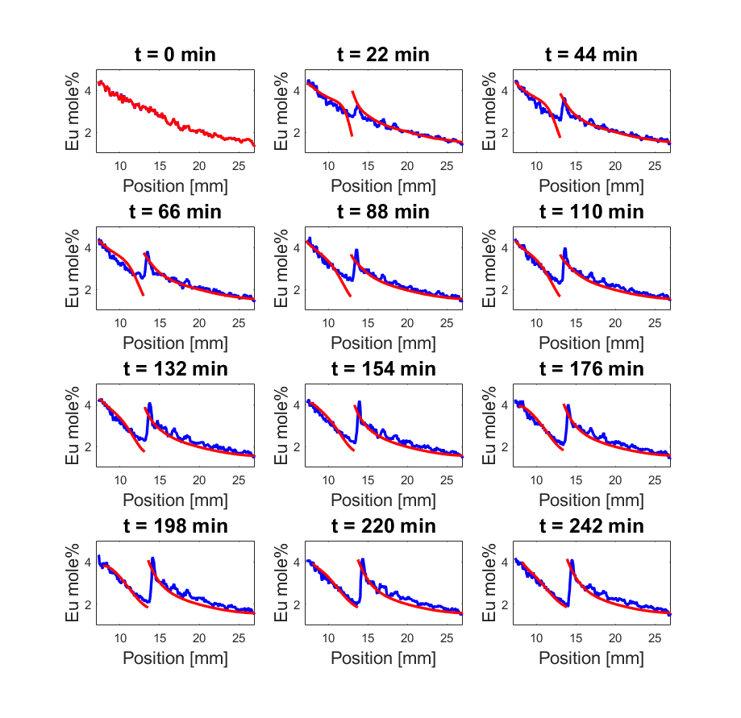
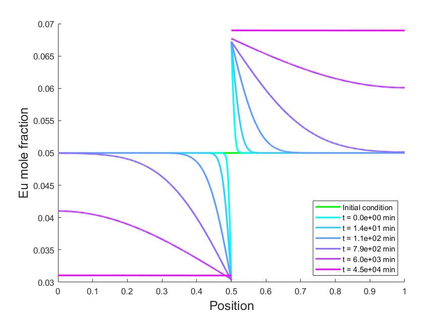

# Eu Diffusion Couple

## Description
Here, a two-phase (liquid and solid) coupled diffusion problem with a moving boundary is solved using two methods: finite difference and finite Fourier transforms, as described in Section 3.2, Appendix A, and Appendix B of [this paper](https://doi.org/10.1016/j.actamat.2020.01.013).  By solving these problems, we are able to deduce important physical parameters about the system, namely the diffusivity of Europium in the solid and liquid phases in the experimental conditions.  There are a number of helper files that were used to process raw data from experimental collaborators, namely energy-resolved neutron imaging data (like x-rays, but they can penetrate the materials we were studying!).  This neutron imaging data serves as both the initial condition of my models and as model validation to compare results against.  Process_Eu_iRadon.m performs a number of image processing operations on the raw data which is similar in nature to the image processing used for MRIs and CAT scans (i.e. inverse Radon transforms).  There is a menu of options in lines 32-37 for what processing steps to take, though by default I have set it to read preprocessed results (processing all the raw neutron imaging data takes ~20 minutes on a desktop computer and requires the MATLAB Image Processing toolbox).

The files here include the analysis and creation of data plots in the accompanied PDF publication.  For an in-depth understanding of model derivation, please see the included PDF or visit the link to the above publication.

`Eu_segregation_FiniteDifference5.m` creates the data plot for Figure 7:

`Eu_segregation_FiniteFourierTransform6.m` creates the basis for Figure B1:

### Publication Abstract
Energy-resolved neutron imaging is employed for in-situ measurements of dopant transport in a simple experiment performed before the crystal growth of the scintillator BaBrCl:5%Eu via a vertical gradient freeze technique. During a stabilization period preceding growth, we observed the diffusion of Eu from the solid phase into the melt over a period of approximately 4 h. Comparing the measured centerline concentration profile with a mathematical model for the system, we estimate the solid-state diffusivity of Eu in BaBrCl as 1.9e-10 m^2/s and an upper limit for the liquid-phase diffusivity of Eu in the melt as 2.5e10-10 m^2/s, at temperatures near the melting point. We compare this experiment, where diffusion is driven by a concentration discontinuity arising from segregation, to the classical diffusion couple technique. Suggestions are offered on how this segregation-driven couple might be improved as a tool for measuring diffusion coefficients, and we draw attention to the great promise of neutron imaging for in-situ measurements of the distribution of elements, with sufficiently high neutron attenuation coefficients, in difficult environments.

### Relevant files

- `Process_Eu_iRadon.m` - This script processes the raw neutron imaging data.  There is a menu of options between lines 32-37.  They are set to process the raw neutron imaging data completely, which takes ~15 minutes on a consumer desktop computer.  
    - The script will produce the following files:
        - `.\IRad_export_a-90_merged_cyl_b\IRad_export_a-90_merged_cyl_b_1D.mat` - Processed data (via inverse-Radon transform) saved as binary MATLAB data file
    - The script also calls functions in the following files:
        - `Eu_read.m` - Reads in the raw neutron data in .txt data files
        - `Eu_irad.m` - Takes each row from raw neutron data and performs the inverse-radon transformation on it to recover a true 2D z-slice concentration data 
        - `Eu_get1D_cyl.m` - Takes a set of 2D z-slice concentration data and averages to form a single-dimensional concentration profile down the length of the melt

- `Eu_segregation_FiniteDifference5.m` - This script employs finite difference method to solve the diffusion couple problem with stationary and moving reference frames
- `Eu_segregation_FiniteFourierTransform6.m` - This script employs finite Foufier transform method to solve the diffusion couple problem with a moving reference frame
    
## Setup and Use

Run `Process_Eu_iRadon.m` with default settings.  This will process the raw experimental neutron imaging data which will be used both to serve as an initial condition for later models and serve as an comparison (this takes ~15 minutes on a consumer desktop computer).  Then, you can run `Eu_segregation_FiniteDifference5.m` or `Eu_segregation_FiniteFourierTransform6.m`.